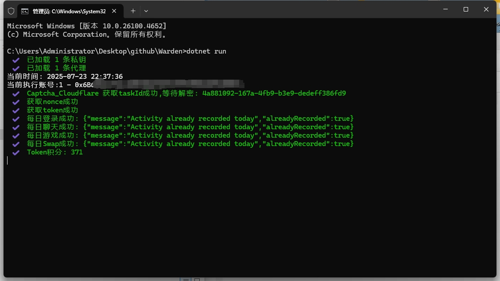

# Warden 自动交互脚本
## 🚀简介  
   #### 此项目为 Warden Protocol 自动化交互工具，支持多账号、多代理、批量完成每日对话、登录、游戏等交互。

## 📝功能说明  

- 自动完成每日任务（登录、AI 对话、小游戏）
- 推荐码拉新及自动生成 Token 新币种（推荐用于邀请小号，已默认关闭）
- Swap 功能（未与AI链上交互，仅能获得小量代币奖励）
- 多账号批量操作
- 支持 HTTP/HTTPS 代理
- 日志输出到控制台及本地文件（`Log.txt` 及 `Log.csv`）
- 24小时循环执行循环执行，失败自动重试

## 🖥️ 系统支持
* Windows、macOS、Linux

## 🚨前置准备 [必须] 

由于项目启用了 Cloudflare 的人机验证，需配置打码服务才能正常使用。

   #### 😨 如果你不会编程，请按照以下步骤操作：

   1. 注册打码服务平台，并充值（ **10 RMB** 可打码约 **1800** 次）：
      👉 [1Captcha 注册链接](https://1captcha.vip/user/register?cps=I9HWoDBe)
       ```
       > 该链接包含我的邀请码，没注册过的朋友欢迎支持一下！
       > 如发现有更优惠的打码平台，可以联系我！
       ```
   2. 复制打码平台里的密钥，并粘贴到项目根目录下的 `CaptchaKey.txt` 文件中

   ---

   #### 👨‍💻 如果你具备编程和部署能力，请参考以下说明：

   1. 部署打码服务
   2. 使用 HTTP 请求解码 Turnstile，获得解码结果 token
   3. 将 token 传入 `Init` 方法中即可完成初始化


## 📋 使用说明
1. 安装 [.NET 9 SDK](https://dotnet.microsoft.com/download/dotnet/9.0)
   ```
      >  Windows 用户：请选择 `SDK -> Windows -> x64 / x86`  
      >  macOS 用户：请选择 `SDK -> macOS -> Arm64 / x64`  
      >  如果你不打算修改代码或编译源码，可以直接下载并运行已编译好的 [Release]
   ```
2. 打开终端（CMD / PowerShell / Terminal），进入项目目录：
   ```
      cd path/to/your/project
   ```
3. 运行脚本：
   ```
      dotnet run
   ```

## 📦 文件结构

* `PrivateKey.txt`：每行一以太坊私钥
* `Proxy.txt`：每行一个代理，支持以下格式（不支持SOCKS)：
* `CaptchaKey.txt`: 打码平台的密钥
   ```txt
   ip:port
   http://ip:port
   https://ip:port
   http://username:password@ip:port
   https://username:password@ip:port
   ```
* `Log.txt`：运行日志自动写入本文件
* `Log.csv`：记录每日积分情况


## 🌌 运行截图  
下图为脚本运行时的终端界面示意：




## 🤝 贡献指南

欢迎提交 Issues 或 Pull Requests

---
#### ☕️ Coffee
- 🪪 Address: `0xE8Be55CA5Bdb6970F82bA508160C8D2688888888`  
- 🔗 Contact on [X](https://x.com/CryptoPidan) ｜ [Telegram](https://t.me/CryptoPidan)
---

